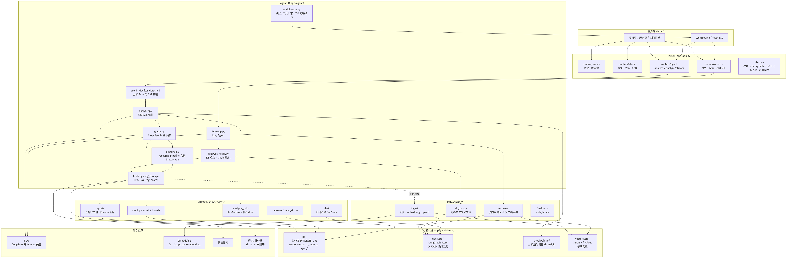
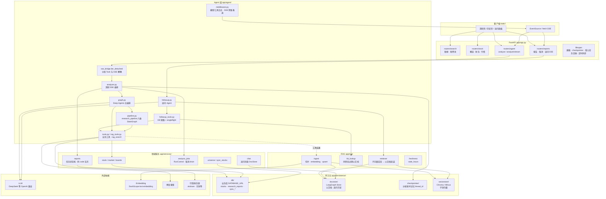
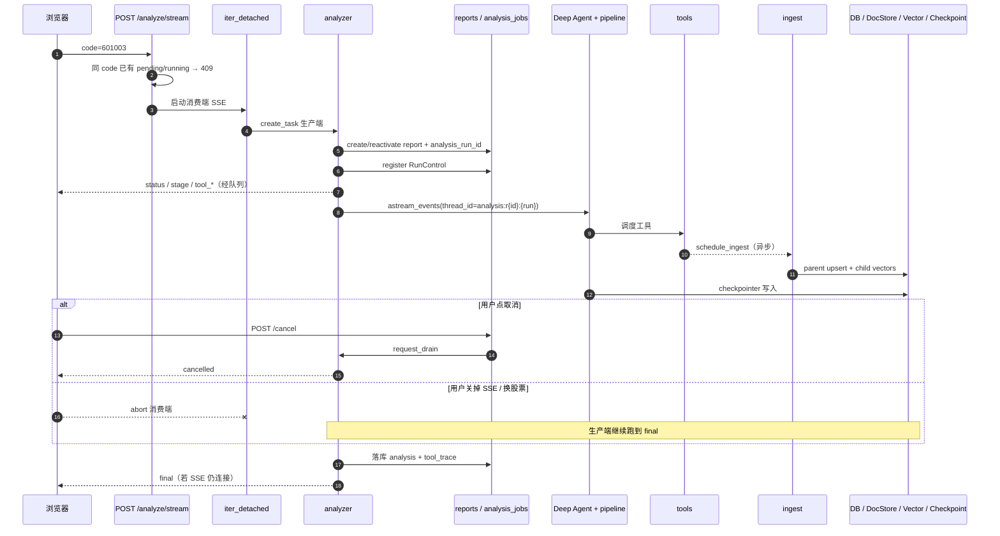
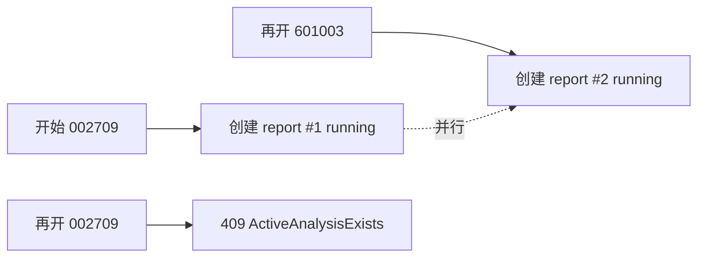
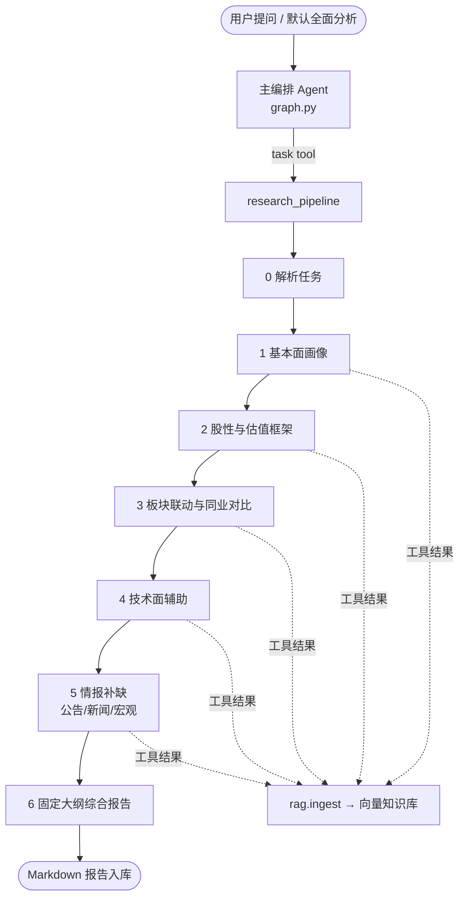
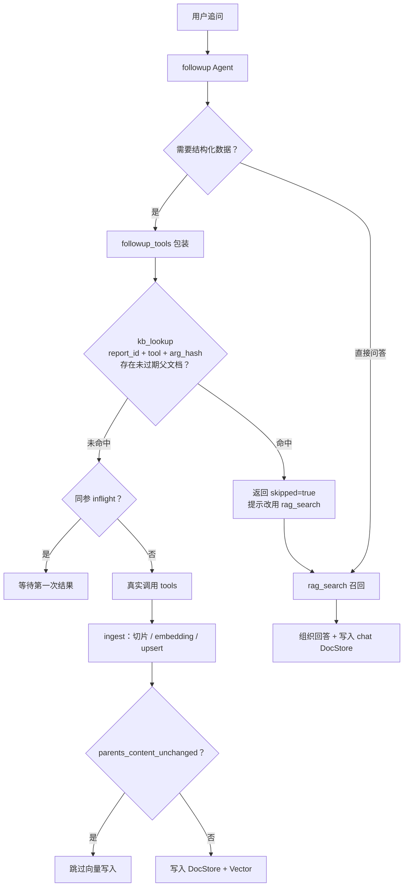
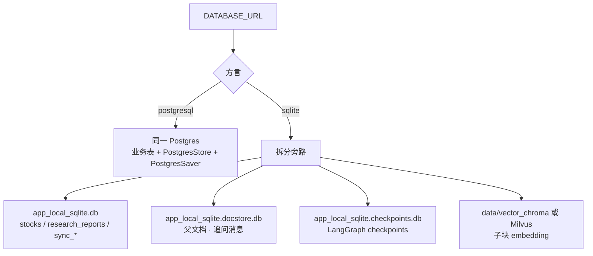

# A股深研 API

基于 **FastAPI** 的个股深研工作台：股票池检索、财务/行情查询、Deep Agents + LangGraph 六维投研流水线（SSE）、报告持久化、追问 RAG。

用于信息整合与可解释分析，不提供买卖建议，也不是量化交易系统。

---

## 目录

- [架构总览](#架构总览)
- [请求链路](#请求链路)
- [六维深研流水线](#六维深研流水线)
- [追问 RAG 与去重](#追问-rag-与去重)
- [持久化分层](#持久化分层)
- [项目结构](#项目结构)
- [主要 API](#主要-api)
- [快速开始](#快速开始)
- [配置要点](#配置要点)
- [设计说明](#设计说明)

---

## 架构总览

下图按「浏览器 → API → Agent → 工具/RAG → 存储」分层，标出运行时职责与数据落点。



<details>
<summary>Mermaid 源码（可编辑）</summary>



</details>

### 模块职责一览

| 层级 | 职责 |
|------|------|
| **routers** | HTTP/SSE 边界、参数校验、409 冲突 |
| **agent** | 主编排、六维子图、追问、工具、流式进度 |
| **services** | 股票/板块业务、报告状态、取消控制、聊天 |
| **rag** | 入库、新鲜度、短路查询、召回 |
| **persistence** | 业务库 / DocStore / Checkpointer / 向量库可插拔 |
| **integrations** | LLM Embedding、博查等外部 SDK 封装 |

---

## 请求链路

### 深研分析（可多股票并行）

分析在独立 asyncio Task 中执行；浏览器断开或切换股票只停止 **SSE 收流**，不会误杀后台任务。显式取消走 `POST /api/reports/{id}/cancel` → `RunControl.drain`。



### 同股票互斥 vs 多股票并行



---

## 六维深研流水线

主编排（Deep Agents）调度子智能体 `research_pipeline`（`CompiledSubAgent` + LangGraph `StateGraph`）：



阶段事件通过 SSE `stage` / `tool_start` / `tool_end` 推到前端进度条。

---

## 追问 RAG 与去重

追问目标：**优先复用本报告知识库**，避免同参工具重复拉数、重复 embedding。



要点：

- 父文档 id 前缀：`{report_id}:{tool}:{arg_key}:`（参数不同不会误短路）
- 新鲜度：`RAG_STALE_HOURS`（默认 24h）
- 短路工具集见 `FOLLOWUP_DEDUP_TOOLS`（财务/概览/K 线/同业等；联网搜索默认不短路）
- 召回：子向量检索 → 按 `parent_id` 去重组装父文档再喂模型

---

## 持久化分层

`DATABASE_URL` 决定方言（业务库为 **AsyncEngine + AsyncSession**）；SQLite 下把高频写库拆成旁路文件，降低锁竞争。



| 存储 | 内容 | 选型 |
|------|------|------|
| 业务库 | 股票池、深研报告元数据与正文、同步元信息 | SQLAlchemy · SQLite / Postgres |
| DocStore | RAG 父文档、追问 chat 消息 | LangGraph Store（SqliteDocStore / PostgresStore） |
| Checkpointer | 分析线程短时状态 | AsyncSqliteSaver / AsyncPostgresSaver |
| Vector | 子块向量 | Chroma（本地）/ Milvus（生产） |

`thread_id` 形如：`analysis:r{report_id}:{analysis_run_id}`，保证重跑与多任务隔离。

---

## 项目结构

```
app/
  app.py                 # FastAPI 工厂与 lifespan
  core/                  # config / logging / scheduler
  routers/               # search · stock · agent · reports
  models/                # Pydantic 请求/响应
  services/              # 领域逻辑
  agent/                 # Deep Agents + LangGraph + SSE
  rag/                   # 分块 · 入库 · 召回 · 新鲜度 · KB 短路
  persistence/
    db/                  # SQLAlchemy 业务库
    docstore/            # LangGraph Store + 父文档仓库
    checkpointer/        # 分析 checkpointer
    vectorstore/         # Chroma / Milvus 后端
  integrations/          # 博查 · Embedding
  extensions/stocks/     # 东财板块等 CLI 扩展
static/                  # 前端工作台
data/                    # 本地库与向量数据（gitignore）
logs/                    # app.log / app_debug.log（gitignore）
```

---

## 主要 API

| 方法 | 路径 | 说明 |
|------|------|------|
| GET | `/api/search/suggest` | 股票联想 |
| GET/POST | `/api/search/universe/*` | 股票池状态 / 同步 |
| GET | `/api/stock/{code}/overview` 等 | 概览 / 财务 / 行情 |
| POST | `/api/agent/analyze` | 深研（一次性） |
| POST | `/api/agent/analyze/stream` | 深研（SSE） |
| GET | `/api/reports` · `/api/reports/{id}` | 报告列表 / 详情 |
| POST | `/api/reports/{id}/cancel` | 取消进行中任务 |
| POST | `/api/reports/{id}/chat/stream` | 追问（SSE） |
| GET/DELETE | `/api/reports/{id}/messages` | 追问历史 / 清空 |

深研 SSE 事件：`status` · `stage` · `tool_start` · `tool_end` · `final` · `error` · `cancelled`。

---

## 快速开始

```bash
python -m venv .venv
# Windows
.venv\Scripts\activate
pip install -r requirements.txt
# 如需显式安装向量可选依赖：
# pip install -r requirements-vector.txt

copy .env.example .env
# 编辑 .env：填入 LLM_API_KEY / EMBEDDING_API_KEY / BOCHA_API_KEY 等

start.bat
# 或：python -m uvicorn main:app --reload --host 127.0.0.1 --port 8000
```

浏览器打开：`http://127.0.0.1:8000`

### 板块扩展 CLI

```bash
python -m app.extensions.stocks.lookup_stock_boards 600519 --json
python -m app.extensions.stocks.fetch_concept_boards --help
```

---

## 配置要点

见 `.env.example`。常用项：

| 变量 | 含义 |
|------|------|
| `DATABASE_URL` | 业务库（`sqlite+aiosqlite` / `postgresql+psycopg` 异步）；SQLite 时自动旁路 docstore / checkpoints |
| `VECTOR_BACKEND` | `chroma` / `milvus` |
| `RAG_ENABLED` · `RAG_FOLLOWUP_TOOL` | 入库 / 追问短路开关 |
| `RAG_STALE_HOURS` | 知识库结果过期时间 |
| `AGENT_MAX_TOOL_ROUNDS` | 主编排工具轮次预算 |
| `FOLLOWUP_*_LIMIT` | 追问工具/模型硬上限 |
| `DEBUG` | `true` 时写 `logs/app_debug.log` |

日志：`logs/app.log`。

---

## 设计说明

1. **SSE 与分析解耦**：`iter_detached` 让消费端 abort 不影响生产端，支持多股票并行；取消必须走显式 cancel API。  
2. **同 code 互斥、异 code 并行**：避免同一标的双写报告，同时允许工作台并排深研。  
3. **SQLite 旁路三库**：业务 / DocStore / Checkpointer 分离写锁，缓解 `database is locked`。  
4. **父子文档 RAG**：子块向量召回、父块喂模型；追问用 `report_id+tool+args` 短路减少重复成本。  
5. **RunControl.drain**：协作式取消，避免硬杀半写入状态；`analysis_run_id` 防止旧轮次覆盖新一轮。

---

## 声明

行情与财务数据来自第三方公开接口，可能延迟或失败；输出不构成投资建议。
